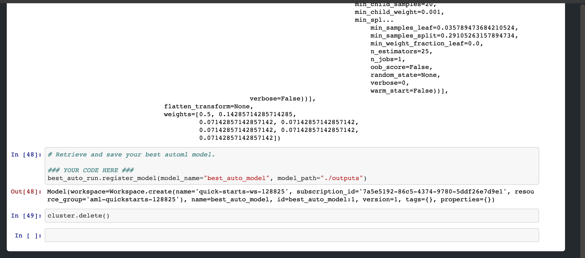

# Optimizing an ML Pipeline in Azure

## Overview
This project is part of the Udacity Azure ML Nanodegree.
In this project, we build and optimize an Azure ML pipeline using the Python SDK and a provided Scikit-learn model.
This model is then compared to an Azure AutoML run.

## Summary

The dataset contains data about a bank marketing campaign to determine whether a given client would subscribe to a 
term deposit or not. The dataset contained information about the last call that was made to the
prospective client about the current campaign as well as information about the client's credit history and demographics.

The best performing model was the one produced by the AutoML run. The model chose a soft voting classifier whose underlying 
classifier was a LightGBM model. The LightGBM model's accuracy was 91.76% which narrowly beat the Logistic Regression model
which gave an accuracy of 91.34%.

## Scikit-learn Pipeline

We first cleansed the data by performing feature engineering on the dataset. For example, month and day of the week variables
were converted from strings to int. Other variables were either binary encoded or dummified (categorically encoded).

We then selected Logistic Regression as our model of choice.

The parameter sampler helps us find the optimal hyperparameters by randomly sampling combinations of them.
The regularization hyperparameter (C) ensures that our model does not overfit the data by penalizing addition of
features. The maximum iterations hyperparameter gives us the number of iterations to be done before we select
our final model.

The bandit termination policy helps us stop the iteration early when the primary metric being evaluated is outside the
slack factor threshold. This helps us to converge to the best model faster.

## AutoML

The AutoML run gives us a gradient boosted tree model as the best model for fitting the data. The gradient boosted tree
is a form of weak learner algorithm that creates many weak learners like decision trees and combines their predictive
power to give a strong learner.

 The model hyperparemeters shows a learning rate of 0.1 which is the rate at which the
gradient converges towards the minima. The colsample_bytree gives us the number of features used for each tree learner. 1.0 means that all columns were selected for creating the learners. The total number of estimators chosen is 25 which is the total number of weak learners used to create the model.

## Pipeline comparison

The Logistic Regression model is a simpler model as compared to the LightGBM model. Logistic Regression uses a simple learner to estimate the data whereas the LightGBM model is an example of a ensembling model where multiple learners are used to predict the target thereby improving the model's ability to predict correctly. 

Moreover, the AutoML run uses scaling methods to scale the features of the dataset so to prevent bias.

It is perhaps these reasons that the AutoML model (LightGBM) edges out the Logistic Regression model in terms of accuracy by 0.42%.

## Future work

The data seemed to have a class imbalance problem where one target class label dominates the sample space of the dataset. This can have adverse problems when predicting the required label because of it's scarcity in the dataset. 

There are techniques to tackle this problem which are known as upsampling where the size of the data is increased by sampling more number of observations that have the minority target labels. This helps the model to "see" more of the minority label which will help improve the predictive power of the model.

Another area of improvement could be changing the metric used for judging the performance of the model. Because we have imbalanced classes, accuracy will not be a good measure of model performance. Scores such as Precision, Recall and F1 will be more tuned towards judging model performance when there are imbalanced classes.

## Proof of cluster clean up

The cluster was cleaned up from within the jupyter notebook. The last line in the notebook
is used for deleting the cluster.

